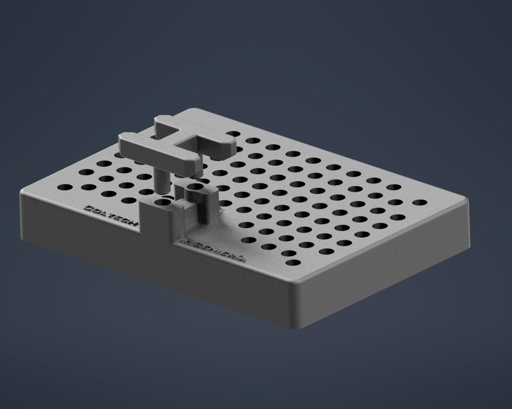
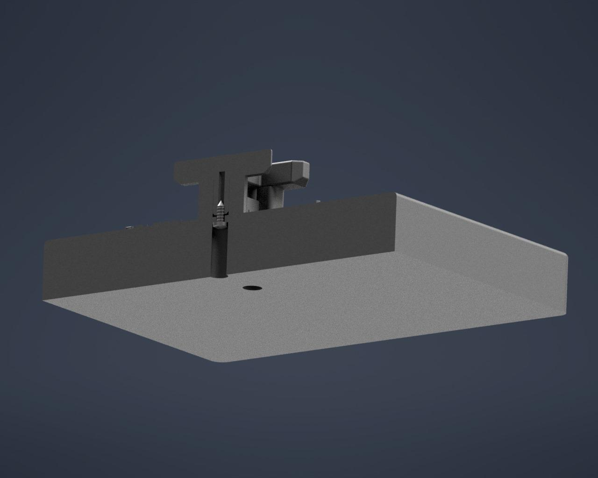
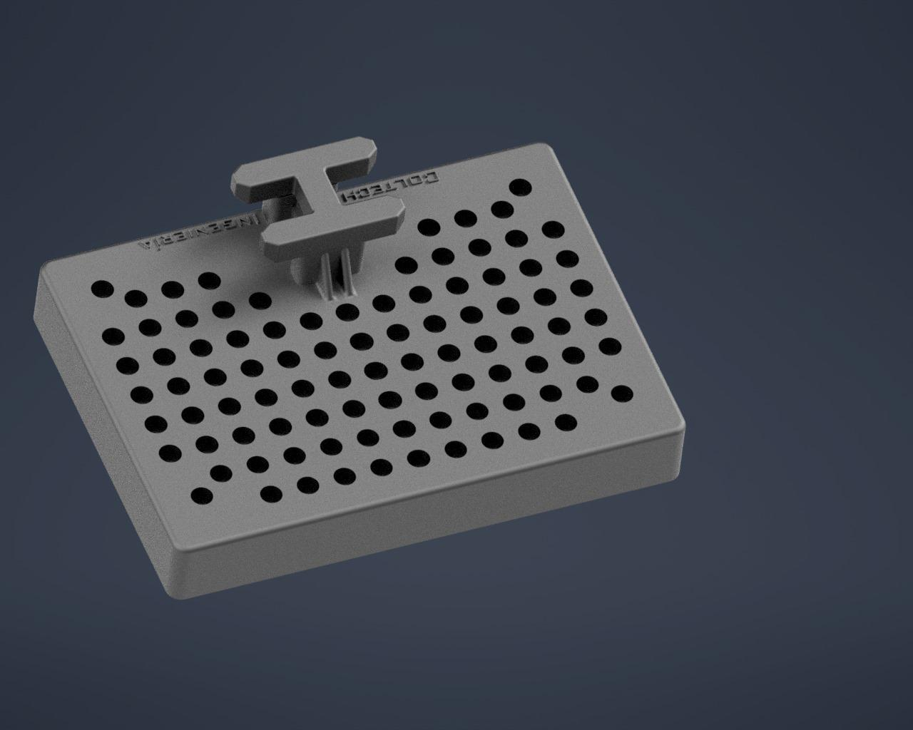
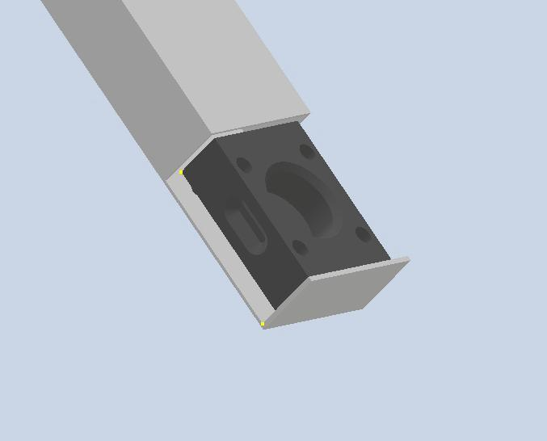

  

# Sistema de Manipulación Automatizada para Brazo Robot

Este repositorio contiene el diseño y documentación de un **sistema modular de manipulación automatizada**, desarrollado en el marco de la **Práctica Profesional Supervisada** de la carrera **Ingeniería Mecatrónica** (UNLZ).

El sistema está pensado para ser utilizado por un **brazo robótico**, permitiendo la sujeción, posicionamiento, almacenamiento y dispensado de piezas de manera **repetible, segura y flexible**.

---

## Descripción del Proyecto

  

El proyecto consiste en el diseño de un conjunto modular compuesto por:

- **Bandeja principal con agarre en forma de H**, diseñada para acoplarse al TCP del robot.
- **Tres piezas intercambiables**:
  - Dos piezas espejadas (derecha e izquierda).
  - Una pieza de mayor longitud.
- **Dispensador por gravedad**, encargado de almacenar y suministrar las piezas al área de pick-up del robot.

Todo el sistema fue desarrollado en **CAD 3D**, priorizando la modularidad, la repetitibilidad en la manipulación robótica y la facilidad de mantenimiento.

---

## Objetivo General

Diseñar y validar un sistema modular de manipulación compuesto por una bandeja con agarre en H, piezas intercambiables y un dispensador, que permita la sujeción, alimentación y manipulación confiable por un brazo robot mediante TCP.

---

## Componentes del Sistema

### 1. Bandeja con agarre en H
- Base de posicionamiento impresa en 3D.
- Orificios hembra para el encastre preciso de las piezas.
- Estructura superior en forma de **H**, optimizada para el agarre del gripper.
- Diseño dividido en dos partes para facilitar el reemplazo ante roturas.

- 

  
  
  

### 2. Piezas intercambiables
- Piezas impresas en 3D.
- Encastres tipo macho para posicionamiento preciso.
- Ranuras laterales para el agarre del TCP.
- Orificio superior para el ingreso de esferas de acero.
- Encastres superiores que permiten modularidad y acople con otras piezas.

### 3. Dispensador por gravedad
- Fabricado en chapa galvanizada plegada.
- Longitud aproximada: 400 mm.
- Inclinación cercana a 45°.
- Alimentación de piezas sin motores ni actuadores.
- Holgura aproximada de 1 mm para evitar trabas.
- Tope final que define la posición exacta de pick-up.
- Diseño que permite el ingreso del gripper sin interferencias.

- 

  
- 

  

---

## Tecnologías y Herramientas

- **Diseño CAD 3D**
- **Impresión 3D** (para bandeja y piezas)
- **Chapa galvanizada plegada** (dispensador)
- Exportación de archivos en formatos **STEP / IGES**

---

## Validación y Pruebas

- Verificación de tolerancias y encastres.
- Pruebas de repetitibilidad en la manipulación.
- Evaluación de estabilidad durante el agarre y traslado.
- Pruebas funcionales del dispensador por gravedad.

---

## Alcance del Proyecto

Este repositorio cubre:
- Diseño y desarrollo del sistema.
- Modelos 3D de todos los componentes.
- Documentación técnica del funcionamiento.
- Base para futuras mejoras y adaptaciones a nuevas geometrías.

No incluye la programación del robot ni la integración con sistemas de control industrial.

---

## Autores

- **De Lio, Nicolás**
- **Bellomi, Federico**
- **Elías Joglar**

Carrera: Ingeniería Mecatrónica  
Facultad de Ingeniería – Universidad Nacional de Lomas de Zamora

---

## Tutores

- Tutor Institucional: Martín González  
- Tutor Académico: Cristian Lukaszewicz

---

## Licencia

Este proyecto se desarrolló con fines académicos.  

---

## 📷 Imágenes y Modelos

Las imágenes, renders y archivos CAD del sistema se encuentran disponibles en el repositorio.

